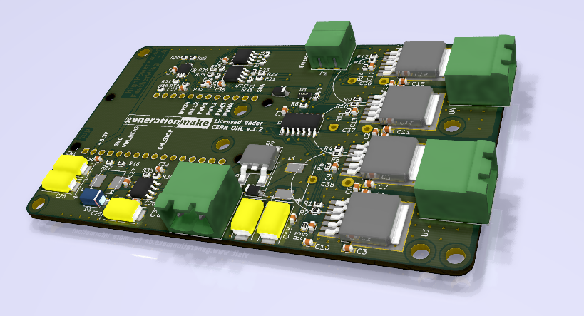
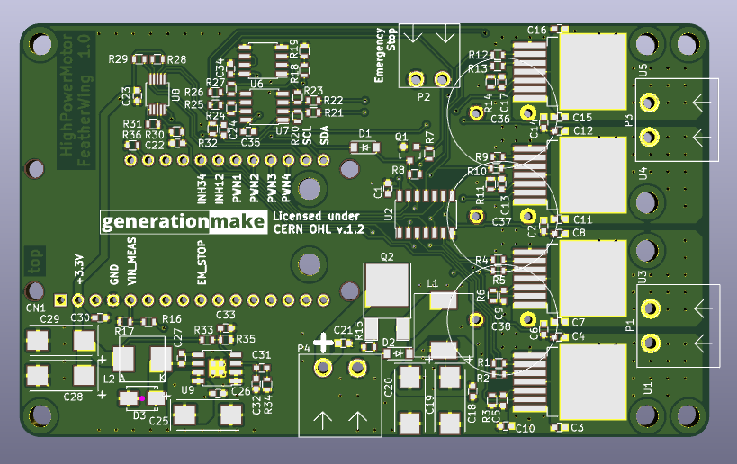
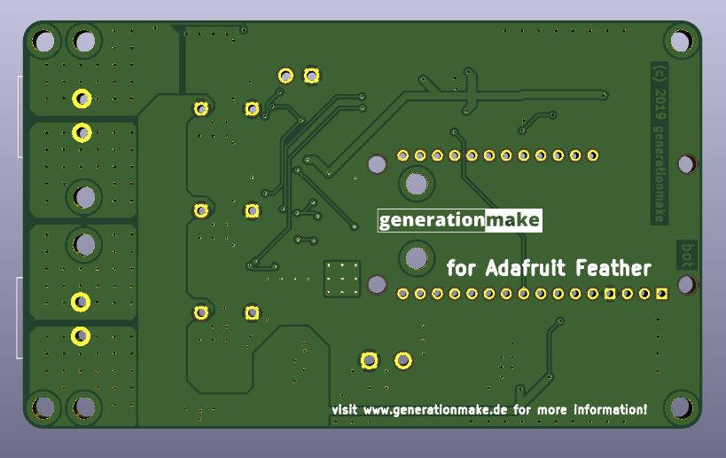

# HighPowerMotorFeatherWing
HighPowerMotorFeatherWing with Infineon IFX007T drivers for two DC motors, up to 40V and 55A, compatible to Adafruit Feather

## PCB

### Top

### Bottom

## License

This hardware is licensed under the CERN OHL v. 1.2

